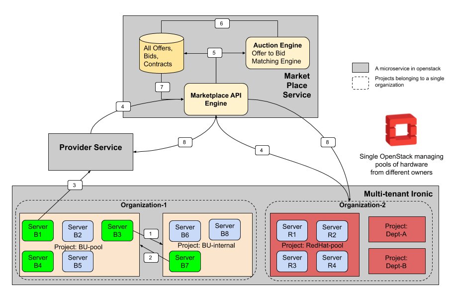

# First Layer of Open Cloud eXchange

FLOCX provides a marketplace for trading physical servers among co-located
pools of hardware where each pool is owned and managed by independent
organizations.  Using FLOCX, organizations can rent nodes from their co-located
neighbors in times of high demand and offer their own resources at a suitable
price when others experience high demand. 

## The Architecture

To enable such a marketplace we will have to create some new services and make
changes to existing OpenStack services.

### Micro-services that make up FLOCX
 
FLOCX consists of the following new micro-services that will be added to
OpenStack:
    
**[Provider Service](https://github.com/CCI-MOC/esi-leap)**: A new
micro-service that offers a platform per OpenStack deployment to manage the
requests for offering servers in the marketplace on behalf of its users.
Owners of decide which servers to offer in the marketplace by submitting their
offers to the provider service.  Provider service then publishes these offers
to the marketplace on their behalf.

**[Marketplace Service](https://github.com/CCI-MOC/flocx-market)**: A new
micro-service that gathers offers, bids and provides contracts when suitable
matches are found between offers and bids.

**[Auction Engine](https://github.com/CCI-MOC/flocx-matcher)**: The matchmaking
service that maps offers to suitable bids and vice-versa.

### Changes to Existing OpenStack Service

**Ironic**: Current release of Ironic (as of summer of 2019) does not support
multi-tenancy.  We will make necessary changes to Ironic so that it can support
multi-tenancy.

A multi-tenant Ironic offer following advantages:

- This allows for logically isolating hardware that belongs to different
  groups. 

- Organizations to put their hardware under the control of a single Ironic
  deployment while maintaining ownership and control of their servers. 

- Small hardware owners (single machine owners) do have to setup a whole
  OpenStack to participate in FLOCX.  They can simply join ironic of any
  existing OpenStack deployments and get started.

## Minimum Viable Product (MVP)

We use agile methodology to develop this system. To begin, we would like to
keep things simple.  Following are the simplifications that we have assumed in
our minimum viable product. 

### Assumptions made for MVP

- There is only one OpenStack deployment managing all hardware from all
  organizations.

- FLOCX-microservices (`provider service` & `marketplace service`) will be
  services added to the single OpenStack deployment.

- All servers are of homogeneous configuration.

- All hardware is managed by Ironic where each organization is assigned a
  project.

### Overview of the workflow of FLOCX MVP

Please refer to the figure for each steps described below:

1. Internally an organization can distribute its hardware by creating new
   projects.

2. Internal projects can add servers that their organization owns which they
   release back when they are done using it.

3. When an organization wishes to make their servers available for rent by
   another organization, they will submit [offers](#offers) to the
   `provider-service`

4. Provider service, after doing necessary authentication and appending the
   hardware configuration information to the offer, will publish the offers in
   the marketplace.  Other organizations that need extra hardware may submit
   [bids](#bids) that describe the hardware configuration they require and the
   price they are willing to pay.

5. The `Marketplace API engine` stores pushes all these offers and bids on a
   continuous basis to the `Auction Engine` and also store them into its
   database.  

6. `Auction Engine` finds suitable matches of offers with bids and creates
   [contracts](#contracts) for all of the suitable matches.  These are stored
   in the marketplace database. 

7. The `Marketplace API engine` fetches the information regarding new contracts.

8. Both the offering and the bidding organizations are notified about the newly
   formed contract. 

## GLOSSARY

### Offers 

Contains data about the server available for rent. Includes information like
hardware configuration, Beginning and Ending time of availability and price at
which the server is available for rent.
    
### Bids

Contains data about the type of machine the bidders wishes to rent. It includes
information like `start_time` - when the server is needed, `Duration`: how long
will it be used, `price`: what is the price the bidder is willing to pay. It
also includes desired hardware configuration if any.  
    
### Contracts

Contains data about which offers have matched with particular bid. It also
states the duration for which the servers will be available on rent and rate at
which the rent will be charged. 
