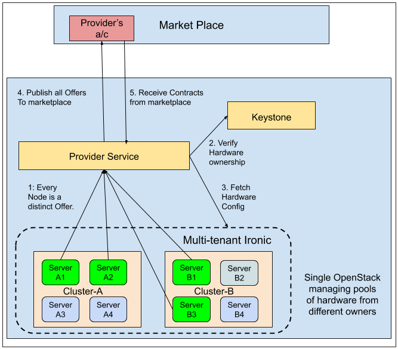

# Provider's view of the FLOCX

## Multi-tenant IRONIC:
Ironic manages multiple pools of hardware each owned by a separate user/group/organization.

## Provider Service:
A centralized service per OpenStack deployment that manages offers and contracts 
on behalf of all its tenants of the OpenStack.

## Keystone:
Provides authentication and authorization services.

## Workflow:

Following steps describe the process of offering physical hardware in the market by individual owners
and receiving contracts from the marketplace.

1. Hardware pool owners decide which nodes to offer in the marketplace and submit offers to the provider service
2. Provider service confirms owner-hardware relationship before accepting offers. 
3. For each accepted offer it fetches the hardware configuration from Ironic
4. These offers are published to the marketplace as soon as possible. 
5. Receives contracts from the marketplace.

## Offers (Owners --> Providers):
An offer made by an owner and submitted to the provider service will have following attributes.
* Node ID: Unique ID of the node
* Start time: Date and time of availability
* Duration: Hours, days that the node will be available
* Floor Price: Minimum Price that is demanded.
* properties: This defines additional properties relevant to the offer which are not intrinsic 
to the resource itself (intrinsic properties are fetched from services like Ironic and passed onwards)

Provider validates the offer received from the owner  from keystone and adds the following attributes:
* Offer ID: Unique ID for each offer.
* Created_at:
* Status: Waiting 

    * Possible values: 
    * Waiting: When provider accepts offer from the owner
    * Published: When provider publishes the offer in the marketplace
    * InContract: When an offer finds a suitable bid and a contract is formed.
    * Expired: For any reason if the offer is cancelled or gets past its time of availability or gets used.

Provider also fetches the node configuration from Ironic and adds it to the offer. 

* Node Configuration: (as extracted from Ironic)

## Offers (Providers --> Marketplace):
An offer that the provider service publishes to the Marketplace will have following attributes.
* Offer ID: Unique ID per offer
* Node ID: Unique ID of the node
* Start time: Date and time of availability
* Duration: Hours, days that the node will be available
* Floor Price: Minimum Price that is demanded. 
* Node configuration (as fetched from Ironic)
* Status: Published
* properties: This defines additional properties relevant to the offer which are not intrinsic 
to the resource itself (intrinsic properties are fetched from services like Ironic and passed onwards)
* Created_at: 

## Contract:

a Contract will be made up of following attributes:

* Contract ID: Unique ID per contract
* List of Offers: The exact nodes that will participate in serving this contract can be inferred from the list of offers.  
* Start Time: Contract commencement (date and time)
* Duration: Time span the contract lasts
* Price: Price at which the contract was made.
* properties: This defines additional properties relevant to the contract which are not intrinsic to the resource itself. One example is contract_callback_url.
* Created_at: Timestamp of contract creation (for auditing and other analysis)
